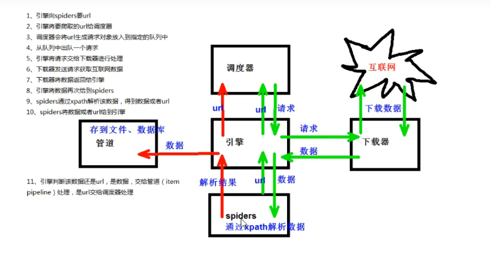

* **scrapy工作原理**
  1. 引擎向spider要url
  2. 引擎将要爬取的url给调度器
  3. 调度器会将url生成请求对象放入到指定的队列中
  4. 从队列中出队一个请求
  5. 引擎将请求交给下载器进行处理
  6. 下载器发送请求获取互联网数据
  7. 下载器将数据返回给引擎
  8. 引擎将数据再次给到spiders
  9. spiders通过xpath解析该数据，获得数据或者url
  10. spiders将数据或者url给到引擎
  11. 引擎判断该数据还是url，是数据，交给管道（item pipeline）处理，是url交给调度器处理。
  
* **scrapyshell是用来调试**
  * 进入到scrapy shell的终端  直接在Windows的终端中输入scrapy+shell+域名
    eg:scrapy shell www.baidu.com
  * 详细教程请观看： [爬虫_scrapy_scrapyshell](https://www.bilibili.com/video/BV1Db4y1m7Ho/?p=94&vd_source=2a411562cb1015d46811fc2c5f78baef) 
  
* CrawlSpider案例

* **scrapy的日志信息和日志等级**
  
  * 日志级别：
  
    CRITICAL：严重错误
  
    ERROR:  一般错误
  
    WRANING：警告
  
    INFO：一般信息
  
    DEBUG：调试信息
  
    ​	默认的日志等级是DEBUG
  
    只能出现了DEBUG或者DEBUG以上的等级的日志
  
    那么这些日志将会被打印
  
  * settings.py文件设置：
  
    ​	默认的级别为DEBUG，会显示上面的所有信息
  
    ​	在配置文件中 settings.py
  
    ​	LOG_FILE：将屏幕显示的信息全部记录到文件中，屏幕不在显示，注意文件后缀一定是.log
  
    ​	LOG_LEVEL：设置日志显示的等级，就是显示那些，不显示那些
  
  * 详细听[可以使scrapy运行结果中杂乱的信息放到一个日志文件中的学习视频](https://www.bilibili.com/video/BV1Db4y1m7Ho?p=103)