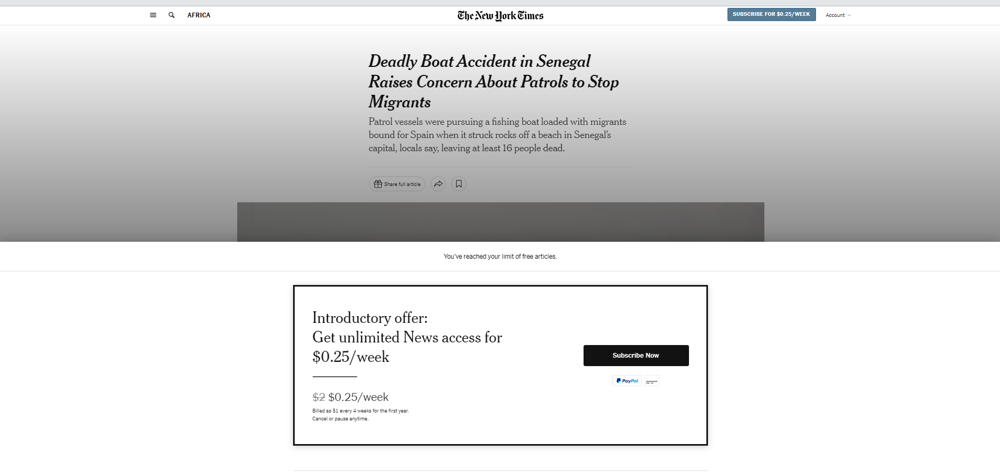
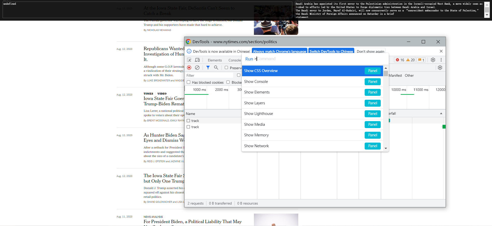
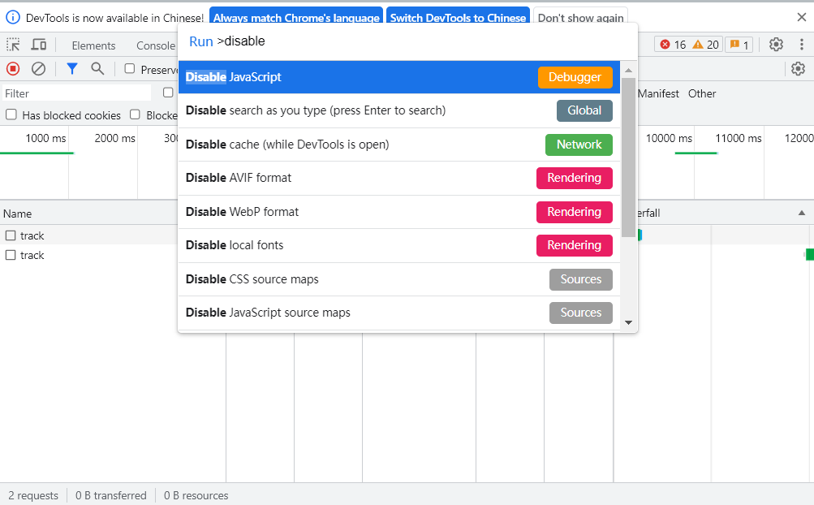
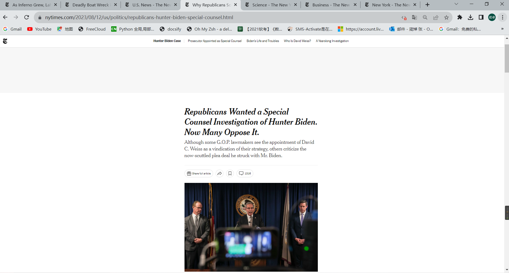

## 在访问浏览器时，出现收费才可以看见的弹窗，如何看不见呢？

例如：https://www.nytimes.com/section/world这个网站

1. 直接打开新闻的话，会出现如下图所示：

   

2. 应该在首页，先按F12，再通过快捷键ctrl+shift+p打开搜索框

3. 搜索disable

4. 点击JavaScript即可进行拦截，在打开你想要看的新闻即可

   例如：https://www.nytimes.com/2023/08/12/us/politics/republicans-hunter-biden-special-counsel.html

   